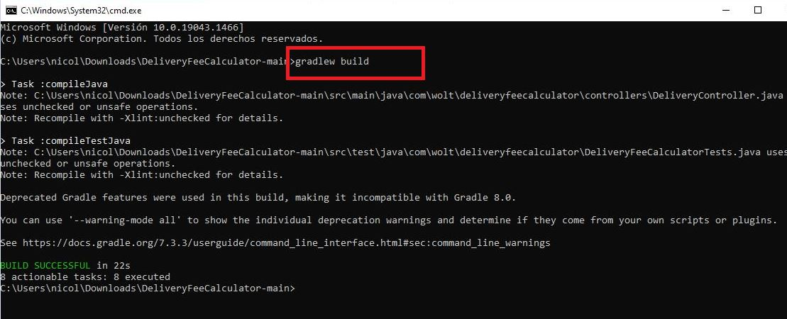
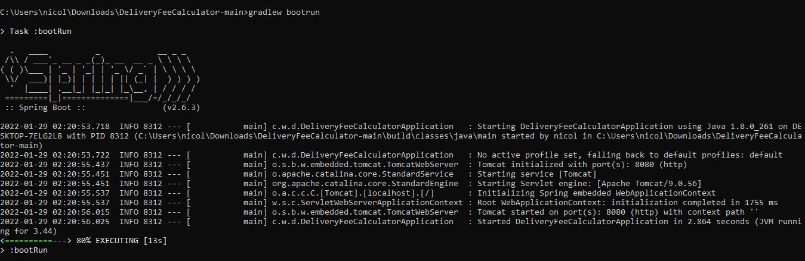
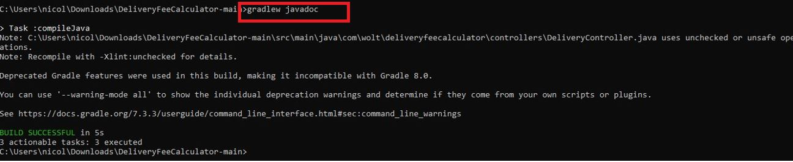
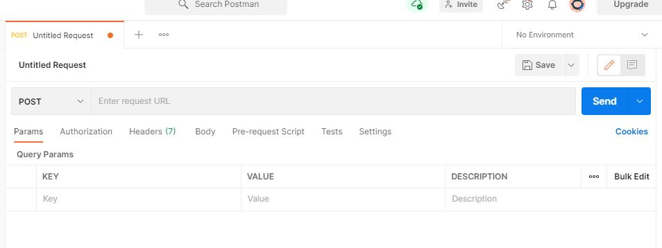
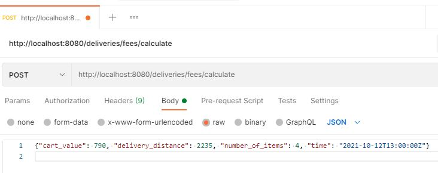
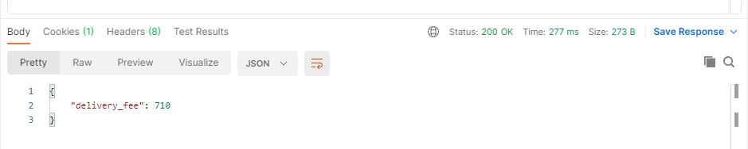
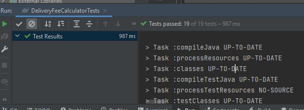
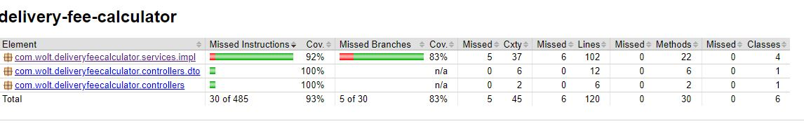

# Software Engineering Summer 2022 Internship / Berlin
## DeliveryFeeCalculator - BackEnd (Java)

Program to calculate the delivery fee. This code is needed when a customer is ready with their shopping cart and we’d like to show them how much the delivery will cost. The delivery price depends on the cart value, the number of items in the cart, the time of the order, and the delivery distance.

## Content

  - [Prerequisites](#Prerequisites)
  - [Execute](#execute)
  - [Use](#use)
  - [Tests](#tests)
  - [Author](#author)
  - [License](#license)

## Prerequisites

* [Gradle](https://gradle.org/) - Dependency Management

* [Java 8](https://www.oracle.com/co/java/technologies/javase/javase-jdk8-downloads.html) -  Development Environment 

* [Git](https://git-scm.com/) - Version Control System

* [Postman API Platform](https://www.postman.com/) - API platform for building and using APIs

## Execute

In the root of the project run the following commands

1. Build the project

```
gradlew build
```

 


2. Runs this project as a Spring Boot application. After executing this command, you can see how to [use](#use) the application

```
gradlew bootrun
```

 


Optional: 

3. Generating the documentation

```
gradlew javadoc
```

 


## Use

1. [Execute](#Execute) the project

2. Open postman 

3. Create a new Post request and enter the following endpoint 

```
http://localhost:8080/deliveries/fees/calculate
```

 

3 Enter the Delivery information in a request payload (JSON) in the body of the request. Here is an example : 

```
{"cart_value": 790, "delivery_distance": 2235, "number_of_items": 4, "time": "2021-10-12T13:00:00Z"}
```

 

4. Send the request and you will get a JSON response with the result of the fee calculation.



## Tests

1. To run the unit tests

```
gradlew test
```

2. 19 unit tests were performed



3. The application's services have a coverage of more than 90%. This report was made with [Jacoco](https://www.eclemma.org/jacoco/)



## Built with

* [Gradle](https://gradle.org/) - Dependency Management

## Author

* Nicolás Aguilera Contreras

## License

This project is under GNU General Public License - see the [LICENSE](LICENSE) file for details


